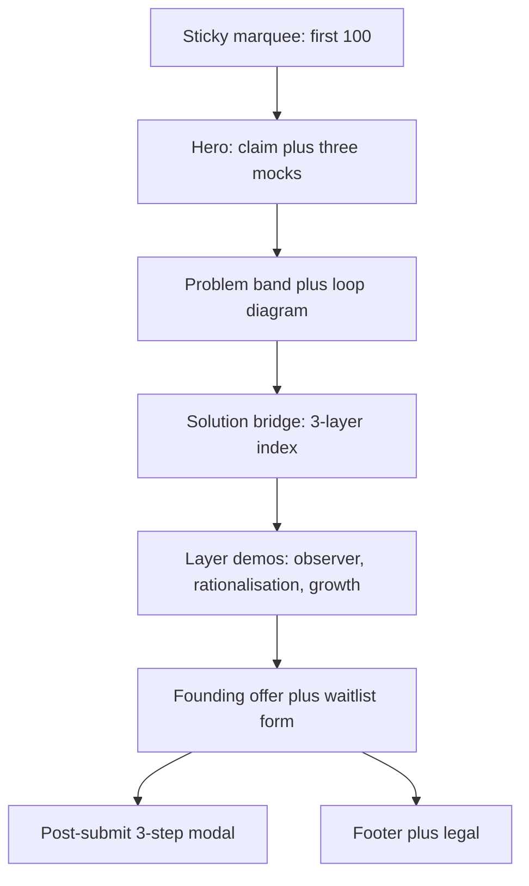

# Waitlist design

**Product:** cognoscene founding waitlist  
**Canonical live page:** [https://cognoscene.com/waitlist](https://cognoscene.com/waitlist)
**Production files on `main`:** `index.html` + `src/worker.js` (Cloudflare Workers)
**Last updated:** 26 Aug 2026
**Status:** Part 1 = as-is record of the live page. Part 2 = proposed structure only — not implemented.

This document records **page structure and design behaviour**. It does not replace:

- [`WAITLIST-PLAN.md`](./WAITLIST-PLAN.md) — GTM, offers, email sequence, tracker
- [`HANDOVER.md`](./HANDOVER.md) — agent rules and brand constants
- [`../MOBILE.md`](../MOBILE.md) — mobile implementation plan / phases

---

## How to use this doc

| Part | Use |
|------|-----|
| **1 — As-is** | Design source of truth for what is live on Cloudflare today |
| **2 — Proposed** | Structure changes filtered by founder constraints. Do not ship until founder signs off |

Quoted strings below are live UI copy (all-lowercase on the page unless noted).

---

# Part 1 — As-is

## 1. Canonical source

The waitlist is hosted on **Cloudflare Workers** from public repo `gencogno/cognoscene-waitlist`. GitHub Pages is a redirecting legacy mirror.

| Item | Live (`main` / Pages) | This workspace copy of `index.html` |
|------|------------------------|-------------------------------------|
| `SITE_URL` | `https://cognoscene.com/waitlist` | `https://cognoscenewaitlist.netlify.app` |
| Cream token | `#edeade` | `#f5f0e8` |
| Lime token | `#b8d878` | `#c8e88a` |
| Hero CTA | `i need this!` | `join the waitlist` |
| Form extras | email + two checkboxes only | email + two checkboxes only |
| Post-submit | 3-step micro-survey modal (`#psmModal`) | none |
| Problem close | financially-vulnerability wording | `there's nothing to interrupt the urge when it hits…` |
| Solution eyebrow | `the solution · cognoscene` | `cognoscene · the key to the problem` |

**Rule:** iterate and specify against GitHub `main`. Sync this workspace before mockup or production edits, or you will silently target a Netlify-era form.

Handover still lists cream `#F5F0E8` / lime `#C8E88A` and a Chrome y/n field. Those describe an earlier baseline, not the live page. This design doc wins for visual tokens and form structure until handover is updated.

---

## 2. Locked constraints (founder)

These constrain both the as-is job of the page and any Part 2 change.

| Constraint | Detail |
|------------|--------|
| Operator | founder `cogno` (`gencogno`) · `cognoscene@gmail.com` · Singapore · pre-incorporation · pre-revenue |
| Binding capacity | **student founder + NS-limited support** — batches, qualification, and copy must reduce unqualified signups and inbound questions, not maximise list size |
| Product today | desktop **Chrome extension** — observer → 48h rationalisation → growth. Not a mobile app. Native apps = roadmap targeting late 2027 |
| Launch | Singapore-first · email-only · 100 founding-offer places · 21-day public waitlist · 2 months free then **us$10 lifetime** |
| Split | Daniella owns Stripe / backend; founder owns GTM and this page |
| Voice | all-lowercase Buffer-style · identity / prudence · no clinical addiction language · no Telegram · no emojis in docs or commits |
| Legal stance | do not describe cognoscene as Pte Ltd; founding checkout is gated (no public Stripe payment link) |

Page job, given the above:

> Capture a **qualified email** from someone who can install on **desktop Chrome** when their batch opens. Mobile visitors may join; they are not the install surface.

---

## 3. Visual system (live)

### 3.1 Tokens

From live `:root` on GitHub `index.html`:

| Token | Value | Use |
|-------|--------|-----|
| `--cream` | `#edeade` | page background, mobile CTA bar |
| `--cream-2` | `#ebe4d4` | secondary cream |
| `--black` | `#111111` | type, marquee, primary buttons |
| `--mid` | `#4a4f47` | body / lead |
| `--muted` | `#8a8a84` | meta, captions |
| `--line` | `#ddd5c0` | borders |
| `--lime` | `#b8d878` | accent, marquee underline, highlights |
| `--lime-muted` | `#a8c870` | submit button text |
| `--green` | `#3b6d11` | platform radio accent |
| `--danger` | `#c45c4a` | errors |
| `--white` | `#ffffff` | cards, mocks |
| `--serif` | Times New Roman, Times, serif | hero / section headlines |
| `--sans` | Be Vietnam Pro, system-ui, sans-serif | UI and body |
| `--max` | `920px` | `.wrap` |
| `--form-max` | `520px` | form column |

Google Fonts load: `Be Vietnam Pro` 400 / 500 / 800. `text-transform: lowercase` is set on `body`.

### 3.2 Assets (do not substitute)

| Asset | Role |
|-------|------|
| `assets/cognoscene-mark.png` | concentric-ring mark (favicon, hero, mocks) |
| `assets/cognoscene-wordmark.png` | lowercase wordmark — hidden on mobile hero |
| `assets/icons/icon-trap-cart.png` | loop card · you buy it |
| `assets/icons/icon-regret-bag.png` | loop card · you regret it |
| `assets/og-share.png` | Open Graph |

Retired SVG placeholders must not return.

### 3.3 Motion

- Top marquee: 32s linear infinite; disabled under `prefers-reduced-motion`
- Primary / submit / founding card: slight translate on hover (also reduced-motion off)
- Showcase videos: autoplay, muted, loop, `playsinline`
- Scroll-triggered swipe highlight (`.stat-highlight`, `.highlight-swipe`, founding `.fc-swipe`) via IntersectionObserver
- Video lightbox fade (~450ms) when changing slider clips
- Mobile roadmap sheet: slide-up dialog

### 3.4 Type roles

| Role | Treatment |
|------|-----------|
| Hero / section H1–H2 | serif, tight tracking, large clamp |
| Eyebrows | small sans, letter-spacing, muted |
| Body / steps | 15px sans, line-height ~1.65 |
| Buttons | pill, sans 14–16px, black fill, lime text |
| Quotes | distinct blockquote ("I wasted $78.49 for no reason." — mixed case inside the quote) |

### 3.5 Spacing and proximity standard

Use this scale whenever a scoped component is edited. It is an adopted standard, not a mandate to refactor every live value at once.

| Token | Value | Use |
|------|-------|-----|
| space-1 | 4px | optical / icon adjustment only |
| space-2 | 8px | default rhythm; eyebrow → title |
| space-3 | 12px | title → supporting copy |
| space-4 | 16px | paragraphs and mobile stacked cards |
| space-5 | 20px | mobile page inset / compact component padding |
| space-6 | 24px | title → component; desktop stacked cards |
| space-8 | 32px | component-group separation |
| space-12 | 48px | mobile major-section spacing |
| space-20 | 80px | desktop major-section spacing |

Rules:

- Base unit: 4px. Default rhythm: 8px. Do not use an “8px-only” rule.
- Use these values for margin, padding, and gap; use px, not cm, for normal layout rhythm.
- Eyebrow → title: 8px. Title → support: 12px. Support → first component: 24px.
- Narrative → pull quote → narrative: 24px between each item in the mobile Problem grid. In reordered mobile grids, remove component margins that would add to the grid gap.
- Preserve text expansion: no fixed text heights or clipping. The page must remain usable when users increase text spacing.
- Hero mock placement may use a documented visual offset as an optical exception.

Breakpoint: **`@media (max-width: 760px)`** for almost all mobile layout. Extra shrink at **380px**. A leftover `.anchor-nav` rule set hides itself at `min-width: 601px`; live scrape did not surface matching nav links — treat as unused CSS unless markup is confirmed on `main`.

---

### 3.5 Desktop visual alignment boundary

At widths **≥761px**, the problem section establishes the visual bounds used by the Solution Bridge:

- **Left boundary:** the farthest-left edge of the problem-copy column.
- **Right boundary:** the farthest-right edge of the scaled three-card loop diagram, including its current **0.16px** overhang beyond the grid column.
- The three Solution Bridge cards must span exactly between these two edges: observer begins at the left boundary; growth ends at the right boundary. Do not constrain this card row to the nominal `--max` edge when it differs from the loop’s visual edge.

---

## 4. Information architecture

Narrative spine on one long page:

**regret claim → see / buy / regret loop → 3 layers of friction → founding offer + email capture → required direction survey**

Chrome-only honesty also lives in:

- desktop `.chrome-band` (hidden on mobile)
- mobile hero `(i)` sheet (`#heroRoadmapSheet`)
- how-band footnote + form trust line

---

## 5. Section inventory

### 5.1 Sticky marquee — `.top-bar`

| | |
|--|--|
| **Job** | Scarcity before the brand: only the first 100 receive the founding offer |
| **Copy** | `first 100 users · 2 months free · convert to lifetime for usd10` (repeated track) |
| **Visual** | Black bar, lime 3px bottom border, edge fade gradients |
| **Interaction** | Sticky `z-index: 100`. Not a nav. Reduced-motion: static wrap, second track hidden |

### 5.2 Hero — `section.hero`

| | Desktop | Mobile (≤760px) |
|--|---------|------------------|
| **Brand** | Mark + wordmark, centered | Mark only, left-aligned; wordmark hidden |
| **H1** | `98% of your regretful decisions happen pre-purchase.` (`#hero-heading`) | `prevent destructive web-impulse buys.` (`.mobile-h1`) |
| **Sub** | `a chrome extension that pauses impulse buys before you pay.` | `we're building cognoscene… vicious cycle of guilt & overspending.` |
| **Lead** | `you buy to feel good, then the package arrives…` | hidden |
| **Chrome band** | `desktop chrome only — laptop or desktop. not mobile safari or in-app browsers.` | hidden |
| **CTA** | `i need this!` → `#waitlist` | same + 44×44 `(i)` `#heroInfoBtn` |
| **Meta** | `100 early-access spots · 2 months free · usd10 lifetime after` | same, 15px |
| **Visual** | Stacked mocks: growth dashboard / browse pulse / 48h hold | Growth mock hidden; browse + hold overlapping |

Mocks (sample UI, not live product data):

- **Growth:** tabs `home` / `growth`; `prudence streak` 3 weeks without urgente bypass; `6 purchases rationalised`
- **Browse:** `let's take it easy — leave the site if you don't need anything.` · leave site / continue
- **Hold:** `act with prudence — checkout paused.` · `48 hours to decide with intention.` · live-looking `48:00:00` timer
- Tag: `sample ui · growth · browse · hold`

**Mobile roadmap sheet** (`#heroRoadmapSheet`, mobile-only):

- Title: `mobile apps are on the roadmap`
- Body: desktop chrome today; android / ios targeting **late 2027**; join now for desktop beta email
- Dismiss: `got it` · backdrop tap

Sticky mobile bar (`.mobile-cta-bar`, shown ≤760px): same `i need this!` anchor to `#waitlist`. `body.has-mobile-cta` adds bottom padding.

### 5.3 Problem — `section.problem-band`

| | |
|--|--|
| **Eyebrow** | `the problem · how it begins` |
| **H2** | `but why? why do we make these decisions in the first place?` (confirm on `main` if still present; live scrape emphasised the lead-in) |
| **Lead-in** | unexpected impulses from social feeds / influencers / FOMO |
| **Beat 1** | gadget + case + bundle; platforms keep you spending; package arrives |
| **Quote** | `"I wasted $78.49 for no reason."` |
| **Beat 2 / close (live)** | dopamine loop; `there's nothing to interrupt the urges when it hits you, leaving you prone to financially vulnerabilities & unnecessary purchase guilt.` |
| **Visual** | SVG hub + three cards: **you see it** (FOMO · endless scroll) → **you buy it** → **you regret it**; kicker `unescapable loop` |
| **Mobile** | Loop `order: -1` above copy; single column |

### 5.4 Solution bridge — `section.solution-bridge`

| | |
|--|--|
| **Eyebrow (live)** | `the solution · cognoscene` |
| **H2** | `hence, we built an extension to prevent you from shopping destructively using friction.` |
| **Label** | `3 layers` |
| **Sub** | `working indefinitely to design prudence.` |
| **Index** | observer — `preventing doom shop-scrolling` · rationalisation — `48 hours to decide if its a waste` · growth — `impulse-driven to prudence` |
| **Mobile** | eyebrow → pause shopping impulses. → three index items. Hide the redundant 3 layers label and legacy subline. |

### 5.5 Solution details — `section.solution-details`

Three `.step-row` blocks. L1 and L3 are pill sliders; L2 is a single clip. Click/tap frame opens `#videoLightbox` (title, looping player, slider nav when multi-clip). Hint: tap to enlarge on touch.

| Layer | Label | Title | Proof | Clips |
|-------|-------|-------|-------|-------|
| 1 Observer | `first layer · observer` | `intercept unnecessary impulses` | soft lookout pulses while browsing shops | `observer-1.mp4` (1st pulse) · `observer-3rd.mp4` (3rd pulse) |
| 2 Rationalisation | `second layer · rationalisation` | `48 hours to decide if you need this` | when you hit checkout, we give you 48 hours to decide whether it’s a waste of money | `demo.mp4` |
| 3 Growth | `third layer · growth` | `reinforce your identity of prudence` | dashboard: streak, rationalised, savings | `growth-smol.mp4` (popup) · `growth-full.mp4` (dashboard) |

Tier notes under each title:

- L1: `you start noticing the urge before it becomes a decision.`
- L2: `48 hours reveals whether you wanted it, or just felt it.`
- L3: `you stop seeing yourself as someone who overspends.`

Footnote: `desktop chrome · you pick the sites · free to start on one site`

Video map: [`../assets/videos/VIDEO-MAP.md`](../assets/videos/VIDEO-MAP.md). Every solution demo uses one fixed 16:10 rounded frame with centred `object-fit: cover`; Rationalisation copy stays left-aligned at every viewport.

### 5.6 Founding offer + waitlist form — `section.form-band#waitlist`

Desktop uses one two-column conversion module: founding offer/terms on the left, waitlist form on the right. Mobile stacks the offer above the form. There is one submit CTA only.

| | |
|--|--|
| **Offer** | `2 months free.` then lifetime premium for `usd10` — one-time, no subscription |
| **Scarcity** | first 100 accepted signups receive the founding offer; general waitlist remains open through the 21-day public window |
| **Reassurance** | `no charge today.` |
| **Terms** | link to `founding-terms.html` |
| **Interaction** | static visual card; no pointer cursor, hover action, or fine print |
| **Form fields** | email + legal checkbox |
| **Platform interest** | collected only in post-submit modal |
| **Gate** | `#waitlistGateStatus` — server-synchronised opens/closes countdown; no public numerical counter |
| **Success** | eligibility-aware confirmation for founding or general waitlist; no charge today |

Gate config in `wrangler.jsonc`:

| Variable | Live value |
|----------|------------|
| `WAITLIST_OPEN_AT` | `2026-08-25T09:00:00+08:00` |
| `WAITLIST_CLOSE_AT` | `2026-09-16T15:15:00+08:00` |
| `FOUNDING_LIMIT` | `100` |

The Worker authoritatively enforces the window. Reaching 100 changes eligibility, not general-waitlist availability.

### 5.8 Footer — `.site-footer`

`© 2026 cognoscene. all rights reserved.`  
Links: privacy · terms · founding offer · `cognoscene@gmail.com` · `built in singapore`

---

## 6. Form payload and post-submit wizard

### 6.1 Primary submit (Cloudflare Worker)

POST `/api/waitlist`

Visible fields:

| Field | Required in UI | Sent in payload? |
|-------|----------------|------------------|
| `email` | yes | yes |
| platform interest | collected after signup in `#psmModal` | no |
| `legal` checkbox — privacy + terms | yes | yes as `legal_agreed` |
| Turnstile token | generated by the managed widget | yes; validated server-side |
| acquisition data | no visible fields | campaign parameters + referrer hostname when available |

Submit button label: `join the waitlist` (hero/sticky CTA is `i need this!`). Trust line: `beta invites roll out in batches · same email for chrome + payment later`.

On success: hide form, show eligibility-aware inline success, then call `openPostSignupModal(survey_token)`.

### 6.2 Post-signup modal (`#psmModal`)

Isolated script so a video error cannot kill it. Questions are required and the user can edit answers on the final review screen. POST `/api/waitlist/survey` uses the opaque token returned by the first submission.

| Step | `data-step` | Prompt | Inputs |
|------|-------------|--------|--------|
| Intro | `intro` | `you're on the list.` / direction-input setup | `sure` |
| 1 | `1` | `where are you based?` | all-country select; singapore · malaysia · united states · united kingdom first |
| 2 | `2` | `how did you find cognoscene?` | social, friend, community, search or other; conditional written detail |
| 3 | `3` | `after chrome, which cognoscene versions would you use?` | other desktop extensions · mobile app · chrome is enough |
| Variants | `variants` | `where would you realistically use cognoscene?` | conditional multi-select browsers and Google Play / App Store |
| Review | `review` | answer confirmation | edit answers · submit answers |
| Done | `done` | Chrome-waitlist confirmation + worldwide prudence message | close |

The raw survey token is held in page memory only. D1 stores its SHA-256 hash. A valid token updates its signup row once and expires after 24 hours.

---

## 7. Desktop vs mobile (behaviour)

| Surface | Desktop | Mobile ≤760px |
|---------|---------|----------------|
| Wordmark | shown | hidden |
| Headline | 98% pre-purchase claim | prevent destructive web-impulse buys |
| Chrome band | shown | hidden — honesty moves to `(i)` sheet |
| Hero lead | shown | hidden |
| Hero mocks | 3-card stack | browse + hold only |
| Loop diagram | beside copy | above copy |
| Videos | autoplay in-flow + lightbox | same; narrower frame |
| Founding card | full | slightly tighter padding |
| Form | same fields | same fields + sticky CTA |
| Roadmap sheet | hidden | `(i)` beside hero CTA |
| Sticky CTA | hidden | `i need this!` |

Analytics: GA4 `G-RJN8BXMBN3` in `<head>`. Plausible optional (`PLAUSIBLE_DOMAIN` empty). Funnel events in [`MOBILE.md`](../MOBILE.md) are **not** implemented.

---

## 8. Adjacent pages

| Page | Role in the waitlist system |
|------|-----------------------------|
| [`founding-terms.html`](../founding-terms.html) | 2 months free · us$10 lifetime · 100-offer cap · 21-day public waitlist · same-email rule · 7-day cooling-off |
| [`privacy.html`](../privacy.html) | waitlist email + required direction survey · Cloudflare Workers / D1 / Turnstile · GA4 |
| [`terms.html`](../terms.html) | 18+ · **desktop google chrome** · waitlist ≠ guaranteed access |

Legal canonical URLs use `cognoscene.com`.

Mockups (`mockups/waitlist.html`, `waitlist-short.html`, `mobile-iphone14-alternate.html`) are iteration surfaces. Do not treat them as live IA.
